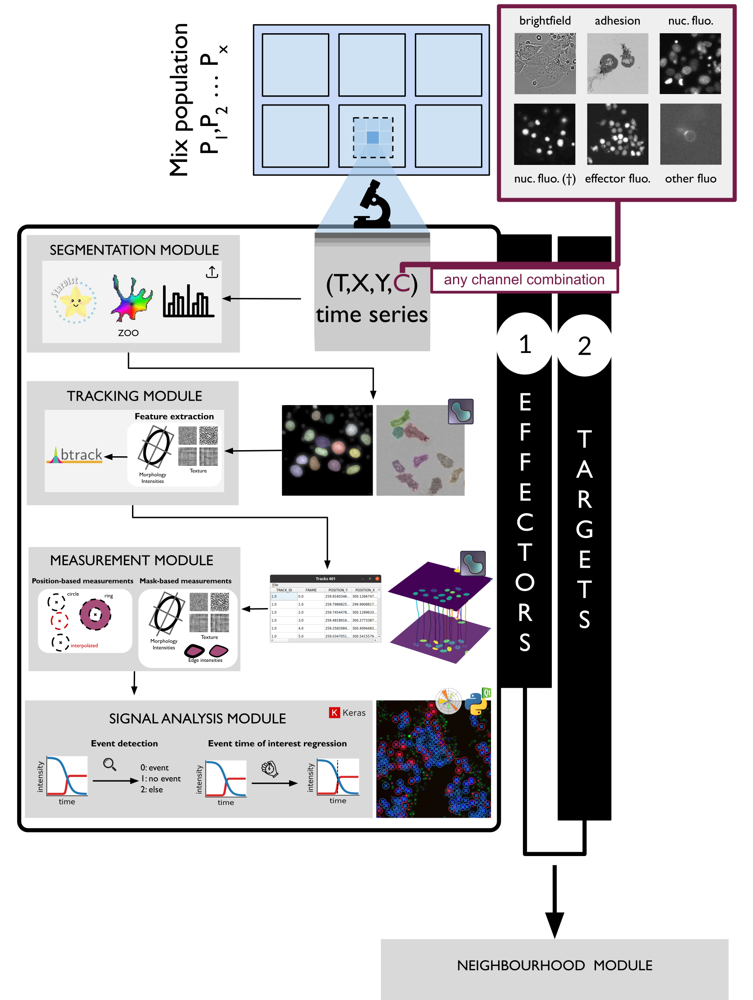

CellDetective
=============

This GitHub template includes fictional Python library
with some basic Sphinx docs.

Installation
============

Via GitHub
----------

If you want to run the latest development version, you can clone the repository to your local machine and install vispy in “development” mode. This means that any changes to the cloned repository will be immediately available in the python environment:

``` bash
# creates "celldetective" folder
git clone git://github.com/remyeltorro/celldetective.git
cd celldetective

# install the celldetective package in editable/development mode
pip install -e .
```

Read the tutorial here:

https://celldetective.readthedocs.io/


