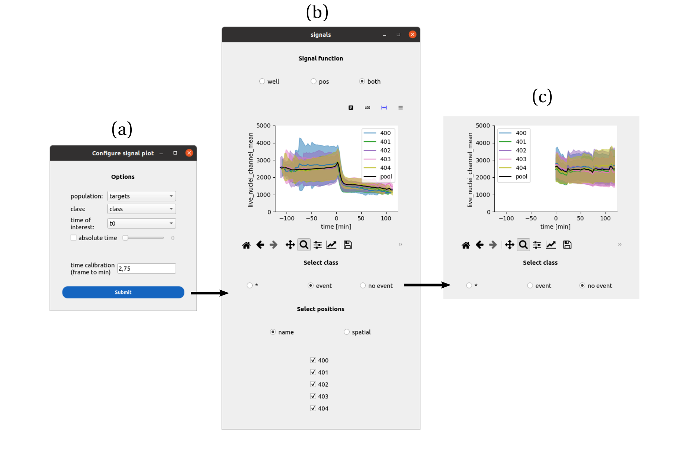
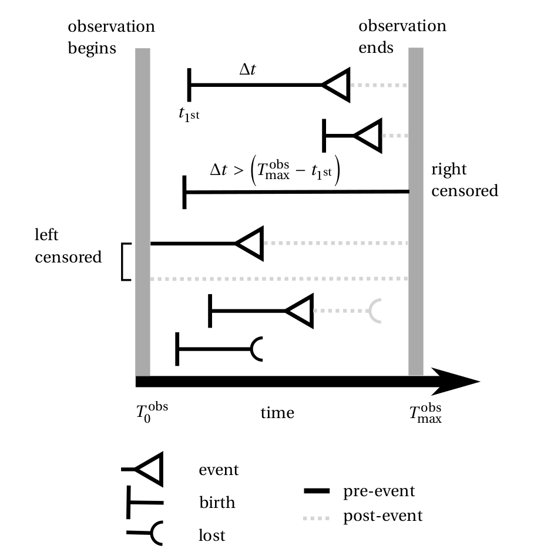
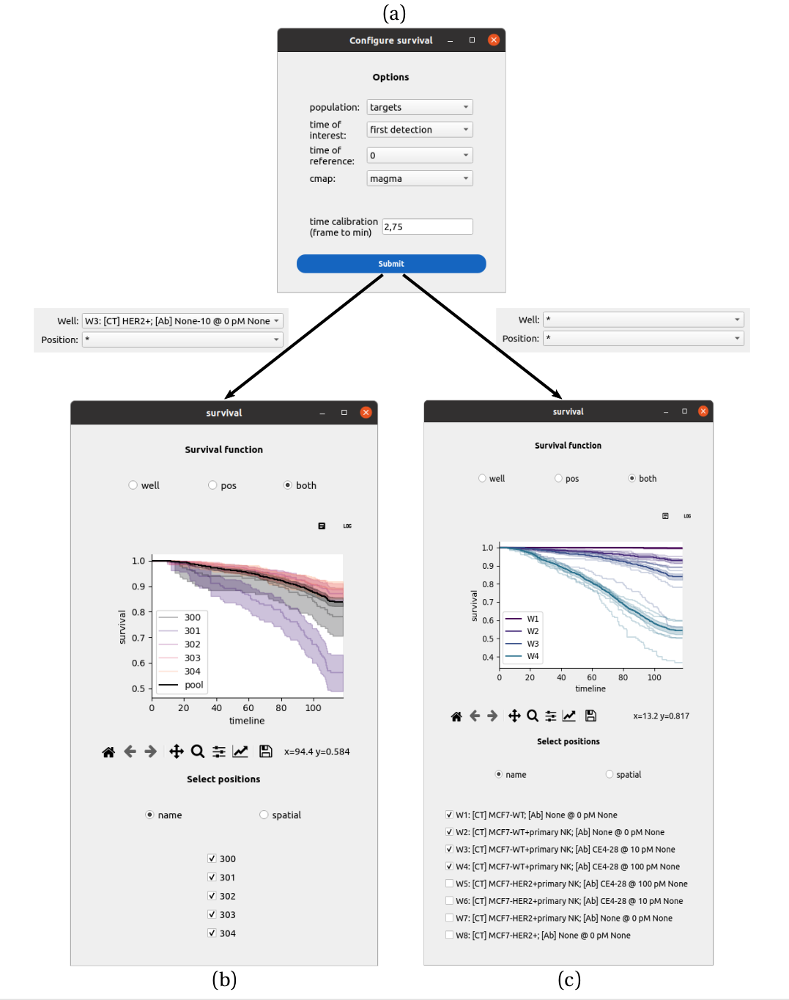

Analysis
========

.. _analysis:

Mean signal response
--------------------

Go to the ``Analyze`` tab, click on the ``plot signals`` button. Configure the cell population of interest, set the class to segregate the cells (the naming convention should follow what you annotated or correct in the signal annotator). Set the associated event time. You can also show the signals using an absolute timepoint to synchronize the signals. Click on ``Submit``. A second window asks for the signal of interest. Pick one in the list and validate. 

    
    **An interface to collapse signals with respect to events.** a) The cell population, class to
    segregate the cells and time of the event is set. Upon submission, a second window asks
    to select a single signal among the signals measured for that cell population. The control
    panel header informs about the data selection, between a single position, multiple positions
    and multiple wells. b) In multiple position mode, the mean signal trace (plus or minus the
    standard deviation) is generated for each position, as well as a pool trace pooling cells from
    all positions. The cells can be filtered between the ones that experienced the event (b) and
    the ones that did not (c), affecting the mean traces.

Survival response
-----------------

Principle
~~~~~~~~~

The survival function, more precisely the Kaplan-Meier estimator, is a practical way to visualize a distribution of event durations :math:`\Delta t_{\textrm{event}}` for a cell population. 

It takes two events to define one such duration, the first event acting as a synchronization time for all the cells. A typical reference event could be the appearance of a cell on the image after sedimentation. Say that we are interested in a subsequent event, *e.g.* the cell divides after some time, then in the signal annotator we annotate the absolute time :math:`t_\textrm{division}` at which each cell divides, and use the time of first appearance :math:`t_{1^{\textrm{st}}}` to synchronize the cells in the survival, defining :math:`\Delta t_{\textrm{event}} = t_\textrm{division} - t_{1^{\textrm{st}}}` for each cell. 

The rules of left and right censorship still apply, therefore a cell that is already on the image at the start of the observation (left censored) should be discarded using this definition of :math:`\Delta t_{\textrm{event}}` whereas a cell that does not exhibit a division event is right censored and can be fed into the Kaplan-Meier estimator with a duration :math:`T_\textrm{max}^\textrm{obs} - t_{1^{\textrm{st}}}` and labeled as "no event" with :math:`T_\textrm{max}^\textrm{obs}` the maximum observation time (the movie duration). The general rule is that left censored durations are excluded from the Kaplan-Meier estimator, unlike the right censored durations which still provide relevant information, *i.e.* the event has not happened yet in the observed duration.

    Left and right censorship of single cell events.

Configure a survival function
~~~~~~~~~~~~~~~~~~~~~~~~~~~~~

Go to the ``Analyze`` tab, click on the ``plot survival`` button. Configure the cell population of interest. Set the time of interest (the event time, *e.g.* the lysis time). Set a time of reference (either another event time or :math:`T = 0`). Submit to view the survival functions. 

Depending on the well/position configuration at the top of the control panel you can view survival functions within a well, across wells etc. 

Compare survival functions
~~~~~~~~~~~~~~~~~~~~~~~~~~

    
    **An interface to represent survival functions at multiple scales.** a) An analysis modules pilots
    the making of survival functions. A cell population of interest is set, a reference time and an
    event time are picked from the list of events available for that population. The control panel
    header informs about the data selection, between a single position, multiple positions and
    multiple wells. b) In multiple-positions mode, each position’s survival function is plotted with
    its 95 % confidence interval, as well as the pooled survival function for the well. Positions
    can be added or removed from the plot. c) In multiple-wells mode, individual positions are
    still shown but without the 95 % confidence interval. Emphasis is put on the pooled survival
    functions that can be compared across wells. As before, wells can be added or removed
    from the plot.

