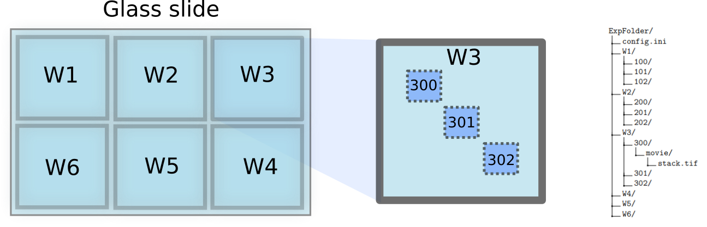
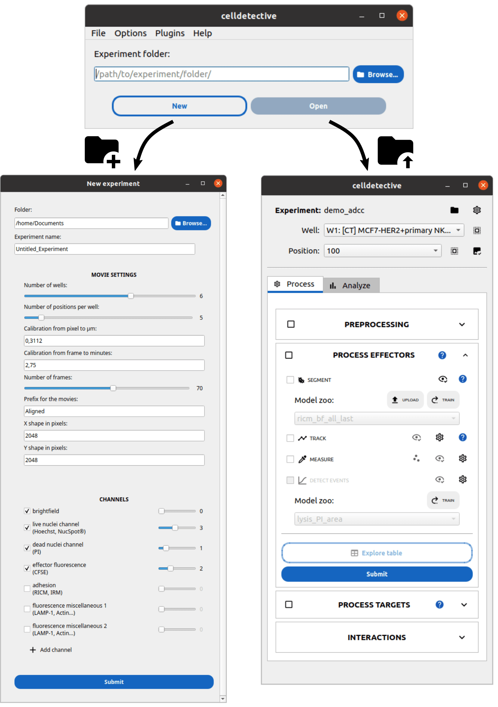
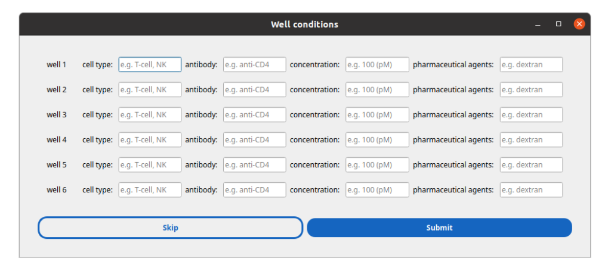

First project
=============

.. _first_experiment:

Input
-----

Celldetective is designed to process multichannel time-lapse microscopy data saved as ``tif`` stacks. These stacks may have the following formats:

- 3D stacks (TXY): Time-series data with spatial dimensions.
- 4D hyperstacks (TCXY): Time-series data with both channel and spatial dimensions.

If your data lacks a time axis but you still wish to use Celldetective for segmentation and measurements, you can substitute the time axis with a tile axis. In this scenario, each stack "frame" represents a different field of view within the well, and you only need to define a single position for the well.

Compatibility with Other Formats:
~~~~~~~~~~~~~~~~~~~~~~~~~~~~~~~~~

- 2D images (XY) and 3D stacks (CXY) are also supported, provided the channel metadata is properly embedded in the file.

Pre-Processing Recommendations
~~~~~~~~~~~~~~~~~~~~~~~~~~~~~~

Microscopy data acquired through :math:`\mu` Manager [#]_ often interlaces the channel dimension with the time dimension to preserve their separation. Before using these stacks in Celldetective, they must be disentangled to ensure proper functionality of the Celldetective viewers.

Before loading your data into Celldetective, we recommend opening the experimental stacks in **ImageJ** (or a similar tool) to verify that the stack dimensions (time, channels, spatial axes) are correctly set.

For large stacks exceeding 5 GB, we recommend using the **Bio-Formats Exporter** plugin in ImageJ to save the stacks. This format optimizes the data for efficient processing and visualization in Celldetective.

Data organization
-----------------

We designed a software that structures experimental data into nested well and position folders, mimicking the spatial segregation in a multi-well plate. The well partitioning allows experimentalists to test in parallel multiple biological conditions, such as different cell types, drugs or antibodies at different concentrations, pre-treatments on the cells or surfaces and so on. 

    
    The experiment folder mimics the organization of the glass slide into wells and fields of view within wells.

Since cells are microscopic objects observed under high magnification, capturing all cells within a well in a single image is rarely feasible. Instead, experimentalists typically select multiple imaging positions within the well, aiming for a representative sample of the entire well.

In Celldetective, single-cell detection is performed independently for each position. The software allows looping through multiple positions or wells, enabling streamlined analysis. Higher-level representations, such as population responses, can aggregate single-cell data from all positions within a well to provide a comprehensive overview.

A **Celldetective experiment** consists of a folder and a configuration file in ``.ini`` format. The folder is organized hierarchically to support data from multiple wells and positions:

#. Experiment folder: Contains individual well folders (one per well) and the configuration file.
#. Well folder: Includes subfolders corresponding to positions within that well.
#. Position folder: Contains a single ``movie/`` subfolder where the user drops the stack associated with that position.

In Celldetective, "processing a movie" is synonymous with processing a position. This approach standardizes workflows and ensures clear data organization.

    
    **Celldetective’s main GUI.** a) the startup window can be used to either (b) create a new experiment or (c) load an experiment. b) The new experiment utility guides the user in the making of an experiment configuration, providing all the necessary information to manipulate the experimental data. c) A control panel interfaces all the processing functions, to detect and measure single cells. The top part controls whether the processing modules should be applied to a position, a well or all wells and conditions sequentially.

.. note::

    The **movie prefix** field allows you to specify a particular movie in a position folder based on its filename (e.g., movies named "Aligned," "Normed," or "Corrected"). While this field can be left blank initially, it becomes especially useful if you perform preprocessing steps on your stacks.

.. note::

    Setting the **number of frames** is optional. In many cases, this information is already embedded in the metadata of the ``tif`` stack. If the metadata does not include this detail, the value you specify here will be used instead.

Creating a new experiment
-------------------------

To automatically generate the folder tree for a new experiment in Celldetective, follow these steps:

#. Open Celldetective and navigate to **File > New Experiment...** or press ``Ctrl+N``.

#. A dialog window will prompt you to select the disk location for the experiment folder.

#. A second window will appear, requesting the information needed to populate the configuration file, including:

    - Number of wells

    - Number of positions per well

    - Spatio-temporal calibration

    - Channel names and their order

#. Once you click **Submit**, another dialog window will ask for a brief description of the biological conditions associated with each well.

#. After submitting the information:

    - The dialog closes.

    - The path to the newly created experiment is automatically loaded in the startup window. Click **Open** to access it.

    - On the disk, the experiment folder is created with a configuration file that looks like the example below.

    
    Celldetective collects information about the biological conditions tested in each well. This information is propagated down to the single cell description.

.. note::

    Condition fields can be left blank, and will default to ``0, 1, 2, ...`` in the configuration file.

Configuration file example
~~~~~~~~~~~~~~~~~~~~~~~~~~

.. code-block:: ini

   # config.ini
   
    [MovieSettings]
    pxtoum = 0.3112
    frametomin = 2.75
    len_movie = 44
    shape_x = 2048
    shape_y = 2048
    movie_prefix = Aligned

    [Channels]
    brightfield_channel = 0
    live_nuclei_channel = 3
    dead_nuclei_channel = 1
    effector_fluo_channel = 2
    adhesion_channel = nan
    fluo_channel_1 = nan
    fluo_channel_2 = nan

    [Labels]
    cell_types = MCF7-HER2+primary NK,MCF7-HER2+primary NK
    antibodies = None,Ab
    concentrations = 0,100
    pharmaceutical_agents = None,None

    [Metadata]
    concentration_units = pM
    cell_donor = 01022022

Configuration file tags
~~~~~~~~~~~~~~~~~~~~~~~

- ``MovieSettings``: Defines image-related parameters such as spatio-temporal calibration, stack length, and filename prefix.
- ``Channels``: Specifies the order of channels in the stack.
- ``Labels``: Provides additional descriptive information for each well in the experiment.
- ``Metadata``: Allows manual addition of extra metadata related to the experiment, which is incorporated into the single-cell data.

Quick acess to the experiment folder
~~~~~~~~~~~~~~~~~~~~~~~~~~~~~~~~~~~~

Once an experiment is opened in Celldetective, you can quickly access its folder by clicking the **folder icon** next to the experiment name in the top menu.

Drag and drop the movies
------------------------

To prepare your data for processing, you need to place each movie into its corresponding position folder, specifically in the ``movie/`` subfolder (e.g., ``W1/100/movie/``).

This step is **not automated**, as variations in acquisition protocols and naming conventions make it difficult to provide a universal solution. If manual placement is too time-consuming, we recommend creating a custom script tailored to your specific data organization.

Once the movies are placed in their respective folders, you can proceed to image processing. Detailed instructions on processing are provided in the next sections.

Bibliography
------------

.. [#] Arthur D Edelstein, Mark A Tsuchida, Nenad Amodaj, Henry Pinkard, Ronald D Vale, and Nico Stuurman (2014), Advanced methods of microscope control using μManager software. Journal of Biological Methods 2014 1(2):e11.
