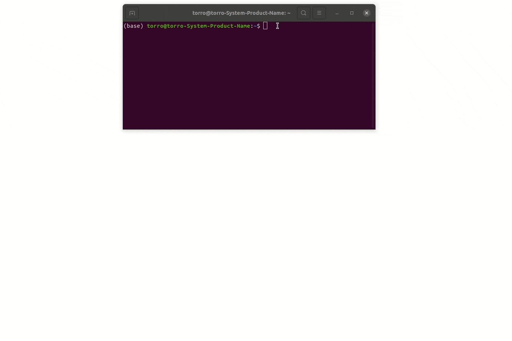

Get started
===========

.. _get_started:

Installation
------------

Stable release
~~~~~~~~~~~~~~

Celldetective requires a version of Python between 3.9 and 3.11 (included). If your Python version is older or more recent, consider using `conda` to create an environment as described below.

With the proper Python version, Celldetective can be directly installed with `pip`:

.. code-block:: console

    $ pip install celldetective

We recommend that you create an environment to use Celldetective, to protect your package versions and fix the Python version *e.g.*
with `conda`:

.. code-block:: console

    $ conda create -n celldetective python=3.11 pyqt
    $ conda activate celldetective
    $ pip install celldetective

Need an update? Simply type the following in the terminal (in your
environment):

.. code-block:: console

    $ pip install --upgrade celldetective

Development version
~~~~~~~~~~~~~~~~~~~

If you want to run the latest development version, you can clone the repository to your local machine and install Celldetective in “development” mode. This means that any changes to the cloned repository will be immediately available in the python environment:

.. code-block:: console

    $ git clone git://github.com/celldetective/celldetective.git
    $ cd celldetective

    # create and activate environment (optional)
    $ conda create -n celldetective python=3.11 pyqt
    $ conda activate celldetective

    $ pip install -r requirements.txt
    $ pip install -e .

You can also use `GitHub Desktop <https://github.com/apps/desktop>`_ to clone the project, typically in /home/username/Documents/GitHub/celldetective. Navigate to this folder in the console and then activate your environment and proceed with the steps above.

To run the latest development version without cloning the repository, you can also use this line:

.. code-block:: console

    $ pip install git+https//github.com/celldetective/celldetective.git

You can also download the repository as a compressed file. Unzip the file and open a terminal at the root of the folder (same level as the file ``requirements.txt``). We recommend that you create a python environment as Celldetective relies on many packages that may interfere with package requirements for other projects. Run the following lines to create an environment named "celldetective":

.. code-block:: console

    $ conda create -n celldetective python=3.9.18 pyqt
    $ conda activate celldetective
    $ pip install -r requirements.txt
    $ pip install -e .

Before launching the software, move to a different directory as running the package locally can create some bugs when locating the models.

.. note::
    
    The installation of ``mahotas`` on Windows requires Microsoft Visual C++ 14.0 or greater, which can be installed `here <https://visualstudio.microsoft.com/visual-cpp-build-tools/>`_. 

.. note::
    
    To use your NVIDIA GPU, make sure to install the proper driver, CUDA and cuDNN libraries (*e.g.* through ``tensorflow[and-cuda]``).

Launching the GUI
-----------------

Once the pip installation is complete, open a terminal and run:

.. code-block:: console

	$ python -m celldetective

    How to launch the software from a terminal, here, without an environment

A startup image is displayed during the loading of the python libraries. Upon completion, the first window of the software opens. 

You can either create a new experiment (button New or shortcut Ctrl+N) or load one.