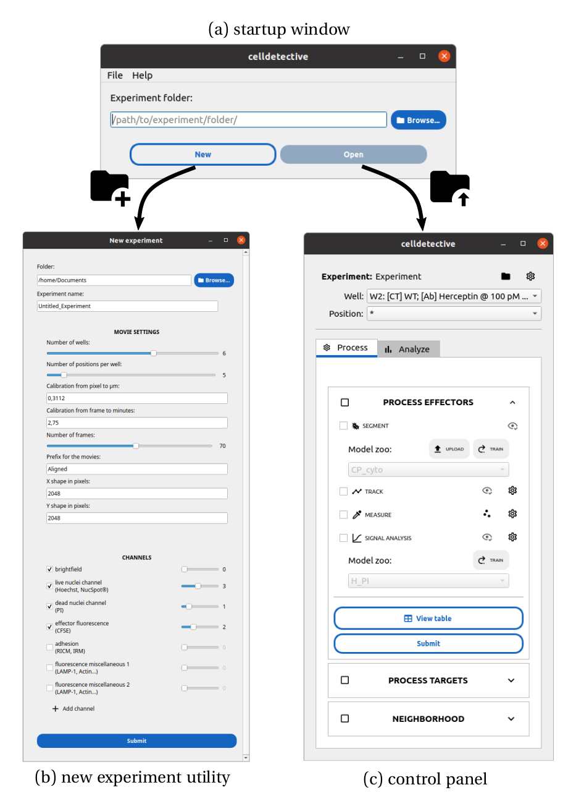
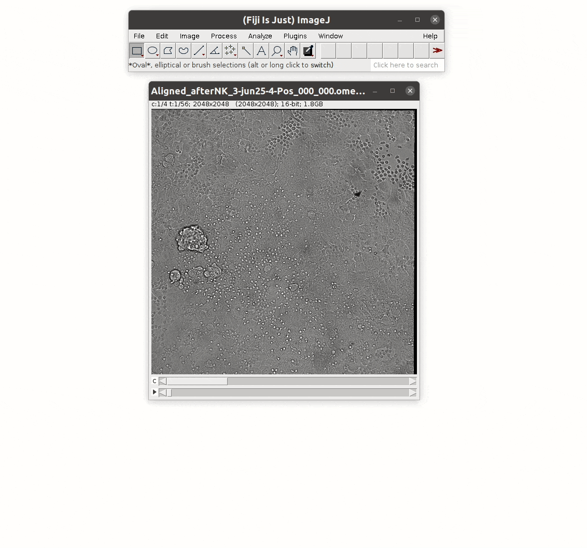

Get started
===========

.. _get_started:

Installation
------------

Stable release
~~~~~~~~~~~~~~

Celldetective can be installed with ``pip``:

.. code-block:: bash

    pip install celldetective

We recommend that you create an environment to use Celldetective, *e.g.* with ``conda``:

.. code-block:: bash

    conda create -n celldetective python=3.9.18 pyqt
    conda activate celldetective
    pip install celldetective

Need an update? Simply type the following in the terminal (in your environment):

.. code-block:: bash

    pip install --upgrade celldetective

Development version
~~~~~~~~~~~~~~~~~~~

If you want to run the latest development version, you can clone the repository to your local machine and install Celldetective in “development” mode. This means that any changes to the cloned repository will be immediately available in the python environment:

.. code-block:: bash

    # creates "celldetective" folder
    git clone git://github.com/remyeltorro/celldetective.git
    cd celldetective

    # install the celldetective package in editable/development mode
    pip install -e .

To run the latest development version without cloning the repository, you can also use this line:

.. code-block:: bash

    pip install git+https//github.com/remyeltorro/celldetective.git

You can also download the repository as a compressed file. Unzip the file and open a terminal at the root of the folder (same level as the file ``requirements.txt``). We recommend that you create a python environment as Celldetective relies on many packages that may interfere with package requirements for other projects. Run the following lines to create an environment named "celldetective":

.. code-block:: bash

    conda create -n celldetective python=3.9.18 pyqt
    conda activate celldetective
    pip install -r requirements.txt
    pip install .

Before launching the software, move to a different directory as running the package locally can create some bugs when locating the models.

.. note::
    
    The installation of ``mahotas`` on Windows requires Microsoft Visual C++ 14.0 or greater, which can be installed `here <https://visualstudio.microsoft.com/visual-cpp-build-tools/>`_. 

.. note::
    
    To use your NVIDIA GPU, make sure to install the proper driver, CUDA and cuDNN libraries (*e.g.* through ``tensorflow[and-cuda]``).

Input
-----

Celldetective processes multichannel time-lapse microscopy data, saved as ``tif`` stacks, which translates into 3D (TXY) or 4D hyperstacks (TCXY). We recommend to open the experimental stacks on ImageJ first to ensure that the dimensions of the stack are properly set. 

.. note::

    With microscopy data acquired through :math:`\mu` Manager [#]_ , it is quite common to have the channel dimension interlaced with the time dimension, to preserve the time-channel dimension separation

.. note::

    On large stack (above 5 Gb), we found it useful to save the stacks using the *Bioformat Exporter* plugin of ImageJ.

If the data is not a time series but you still want to use Celldetective for segmentation and measurements then you can replace the missing time dimension with a position dimension. In this case each stack "frame" is a different field of view within a well, and there is only one position folder and movie for this well.

Launching the GUI
-----------------

Once the pip installation is complete, open a terminal and run:

.. code-block:: console

	$ python -m celldetective

A startup image is displayed during the loading of the python libraries. Upon completion, the first window of the software opens. You can either create a new experiment (button New or shortcut Ctrl+N) or load one.

.. warning::

    Do not open the terminal in the installation folder. Some software features will misbehave.

Data organization
-----------------

We designed a software that structures experimental data into nested well and position folders, mimicking the spatial segregation in a multi-well plate. The well partitioning allows experimentalists to test in parallel multiple biological conditions, such as different cell types, drugs or antibodies at different concentrations, pre-treatments on the cells or surfaces and so on. 

.. figure:: _static/glass-slide.png
    :align: center
    :alt: exp_folder_mimics_glass_slide
    
    The experiment folder mimics the organization of the glass slide into wells and fields of view within wells.

Since cells are microscopic objects, observed at high magnification, it is rarely possible to image all the cells at once. At best, experimentalists pick multiple positions within the well, in the hope that the sampling is representative enough of the whole well. In Celldetective, single-cell detection is always performed at the single position level, with the possibility of looping over many positions or wells. Higher representations, such as population responses, can pool the single-cell information from a whole well (*i.e.* multiple positions).

A Celldetective experiment is only a folder plus a configuration file (written in the ``ini`` format). The experiment folder contains well folders (as many as there are wells). Naturally, each well folder contains as many position folders as there are positions per well. A position folder only contains a movie/ subfolder, where the user must drop the data associated with that position. By force of habit, processing a movie implies processing a position and vice versa.

    
    **Celldetective’s main GUI.** a) the startup window can be used to either (b) create a new experiment or (c) load an experiment. b) The new experiment utility guides the user in the making of an experiment configuration, providing all the necessary information to manipulate the experimental data. c) A control panel interfaces all the processing functions, to detect and measure single cells. The top part controls whether the processing modules should be applied to a position, a well or all wells and conditions sequentially.

.. note::

    The movie prefix field allows you to select a specific movie among several movies in a position folder based on the filename (*e.g.* the "Aligned" or "Normed" movie). 

.. note::

    Setting the number of frames is optionnal as this information is sometimes contained in the metadata of the ``tif`` stack. When it cannot be found, the value selected here is used instead.

Create your first experiment
----------------------------

Generate the folder tree
~~~~~~~~~~~~~~~~~~~~~~~~

To generate automatically such a folder tree, open Celldetective and go to ``File>New experiment...`` or press ``Ctrl+N``.

A dialog window will ask you where on the disk you want to put the experiment folder. A second window, displayed above, will ask for all information needed to fill the configuration file: number of wells, number of positions per well, spatio-temporal calibration, channel names and order...     

Once you click on ``Submit``, a secondary window asks you to describe briefly each biological condition associated with each well.

.. figure:: _static/bio-cond-new-exp.png
    :align: center
    :alt: bio_conditions_new_exp
    
    Celldetective collects information about the biological conditions tested in each well. This information is propagated down to the single cell description.

.. note::

    The condition fields can be left empty. They will be written as 0,1,2... in the configuration file

Upon submission, the window closes, the path to the new experiment is automatically loaded in the startup window. Press ``Open`` to open it. On the disk, an experiment folder was created with a configuration file that looks as follows:

.. code-block:: ini

   # config.ini
   
    [MovieSettings]
    pxtoum = 0.3112
    frametomin = 2.75
    len_movie = 44
    shape_x = 2048
    shape_y = 2048
    movie_prefix = Aligned

    [Channels]
    brightfield_channel = 0
    live_nuclei_channel = 3
    dead_nuclei_channel = 1
    effector_fluo_channel = 2
    adhesion_channel = nan
    fluo_channel_1 = nan
    fluo_channel_2 = nan

    [Labels]
    cell_types = MCF7-HER2+primary NK,MCF7-HER2+primary NK
    antibodies = None,Ab
    concentrations = 0,100
    pharmaceutical_agents = None,None

.. note::

    A shortcut to the experiment folder is available once an experiment is opened in Celldetective by clicking on the folder icon in the top part, next to the experiment name

Drag and drop the movies
~~~~~~~~~~~~~~~~~~~~~~~~

You must now drag and drop each movie in its position folder, in the ``movie/`` subfolder (*e.g.* ``W1/100/movie/``). This process is not automatic as there are many acquisition protocols and naming conventions preventing to have a general way to add movies in their proper place. We encourage you to write a script adapted to your data if the manual deposition is too cumbersome.

Once the movies are in their respective folder, you can start processing the images, which is explained in the next pages.

Image preprocessing
-------------------

Registration
~~~~~~~~~~~~

We highly recommend that you align the movie beforehand using for example, the "Linear Stack Alignment with SIFT Multichannel" tool available in Fiji [#]_ , when activating the PTBIOP update site [#]_ (see discussion here_). We also put `a macro`_ at your disposal to facilitate this preliminary step.

.. _`a macro`: align_macro.html

.. _here: https://forum.image.sc/t/registration-of-multi-channel-timelapse-with-linear-stack-alignment-with-sift/50209/16

    
    Demonstration of the of the SIFT multichannel tool on FIJI

Background correction
~~~~~~~~~~~~~~~~~~~~~

Since version 1.1.0, Celldetective supports two methods of image preprocessing to estimate and correct the background for the target channels. You can define a list of correction protocols that will be run sequentially over the image stack of interest (defined by the ``movie_prefix`` in the experiment configuration). The new stack will have the ``Corrected_`` prefix and can become the stack of interest for segmentation and measurements. 

The first method is model-based. The principle is to fit a background model to the image *in-situ*, by masking the non-homogeneous parts first, with a combination of a Gaussian blur and a standard-deviation filter. You can currently choose between a paraboloid and a plane model to fit the background. The background can be subtracted (with or without clipping) from the images or divided to the image. 

The second method exploits spatial-sampling information to estimate a shared background for each individual condition. For time-series, you can select the frame-range over which you have the highest chances of observing the background (less cells). Non-homogeneous parts are masked using the standard-deviation filter technique from above. A median projection over the multiple positions is performed to estimate the model-free background. This background can be applied to each the original images, for this condition, using the same kind of operations as above. In addition, an optimization can be performed to minimize the intensity difference between the non-homogeneous part of each image and the model-free background, by multiplying the background intensities with a coefficient. 

References
----------

.. [#]  Arthur D Edelstein, Mark A Tsuchida, Nenad Amodaj, Henry Pinkard, Ronald D Vale, and Nico Stuurman (2014), Advanced methods of microscope control using μManager software. Journal of Biological Methods 2014 1(2):e11 <doi:10.14440/jbm.2014.36>

.. [#] Schindelin, J., Arganda-Carreras, I., Frise, E., Kaynig, V., Longair, M., Pietzsch, T., … Cardona, A. (2012). Fiji: an open-source platform for biological-image analysis. Nature Methods, 9(7), 676–682. doi:10.1038/nmeth.2019

.. [#] https://www.epfl.ch/research/facilities/ptbiop/
