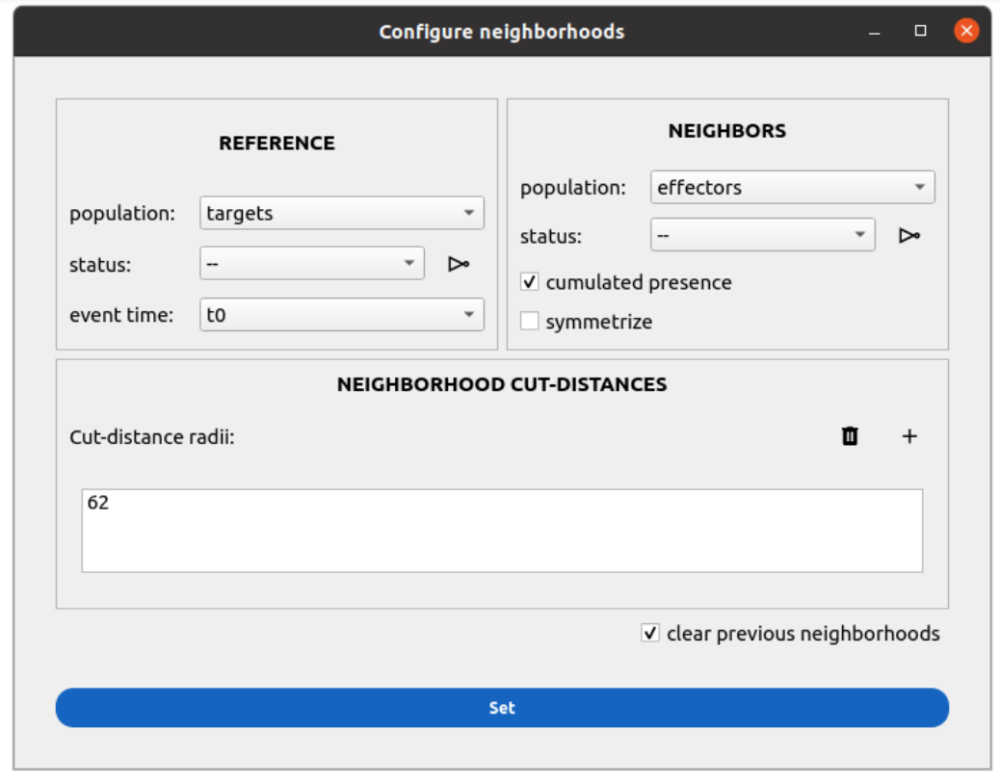
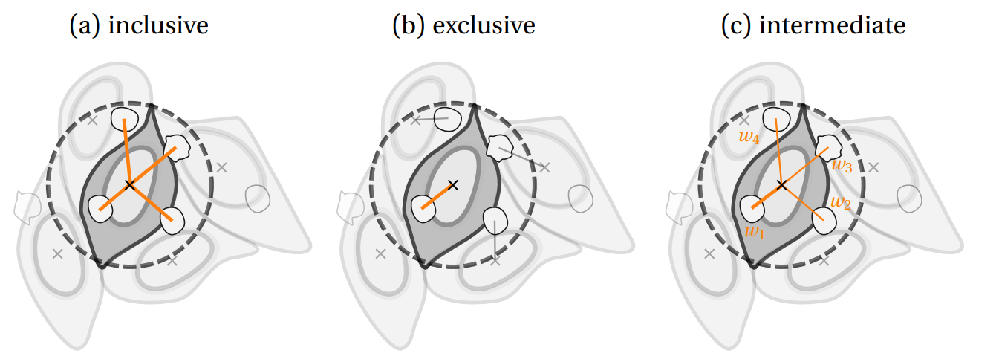

Interactions
============

.. _interactions:

Prerequisites
-------------

You must perform the segmentation and measurements of the cell populations for which you want to compute the neighborhood (at least one).

Neighborhood
------------

Principle
~~~~~~~~~

Celldetective allows a complete and independent characterization of two cell populations that evolve simultaneously on microscopy images. To study the effect of one population on the other, a preliminary step is to match interacting cells, with a neighborhood scheme. We define a reference cell population and look for the neighboring cells at each timepoint. The neighbor population can be the other cell population (*e.g.*  target-effector reference/neighbor populations) or the same cell population (*e.g.* target-target reference/neighbor populations). 

The user can define as many neighborhoods as needed using the two methods described below (isotropic or mask-contact), with as many reference/neighbor population combinations as required. 

A neighborhood column with the proper information characterizing the neighborhood method and distance parameters is written in the reference population table. For each cell at each timepoint, the neighboring cells are written in the neighborhood column as a list. This table is exported in the position folder as a pickle file, instead of CSV. On the other hand, the neighbor counts at each timepoint are written directly in the CSV table for further analysis. 

Neighborhood methods
~~~~~~~~~~~~~~~~~~~~

**Mask-contact.** If the complete masks for the populations of interest are available, the most natural neighborhood to compute is the direct contact between masks. To build a tolerance when evaluating this contact, we allow a mask dilation before contact evaluation, controlled by a distance parameter :math:`d` in pixels. 

**Isotropic.** In the most general case, it is always possible to define an isotropic neighborhood around the center of mass of each object in the system. The only control parameter is the circle's radius :math:`d` in pixels, which determines the largest distance between the center of mass over which two cells can be matched as neighbors. 

Configure a neighborhood measurement
~~~~~~~~~~~~~~~~~~~~~~~~~~~~~~~~~~~~

If you want to compute a neighborhood you can go to the ``INTERACTION``  section of the control panel and open the settings window associated with the ``ISOTROPIC DISTANCE THRESHOLD`` or ``MASK CONTACT`` option. 

    
    **GUI for neighborhood configuration.** After setting the reference and neighbor populations, which can be identical, the user defines as many distances as there are neighborhood distances of interest.

1) Define the reference and neighbor populations. 
2) (Optional): attach a status to the neighbor population. This will allow a decomposition of the neighbor counts with respect to that status (as *count_s0* for the neighbors with a status equal to 0 and *count_s1* for the neighbors with a status equal to 1). An invert button allows you to switch 0 and 1 in the status. 
3) (Optional): enable the computation of the cumulated presence. This only makes sense if the neighbor population is tracked.
4) (Optional): attach an event time to the reference population. This allows the computation of the mean number of neighbors (in status = 1) up to the event time for the reference cells. 
5) Set the distance. We recommend using the viewer (:material-regular:`image_check;2em`) on the right side to tune directly on the image the neighborhood distance of interest. 
6) (Optional): clear the previous neighborhoods (this will erase any previously existing neighborhood computation as well as subsequent pair tables and annotations).

Counting
~~~~~~~~

Most of the difficulties are encountered in the quantification step, as the isotropic neighborhood rarely reflects the true geometry of the system and is therefore subject to over or underestimation of the real number of neighboring cells. To face these difficulties, we introduced three different counting methods:

#. inclusive: all cells inside the circle are counted as neighbors to the reference cell
#. exclusive: attribute each neighbor to the closest reference cell only
#. intermediate: all cells are counted as neighbors but with a weight (the attention weight) that is :math:`1/M` with :math:`M` the number of neighborhoods the neighbor cell is engaged in

    
    **Proposed neighborhood counting methods.** Notice the weights attributed in (c).

After neighborhood attribution, the counts are performed, using each of the three techniques described before, and decomposing by the status of the neighbor cells, yielding 9 counting metrics. In addition, the event time of the reference cell information is exploited to measure the mean neighborhood before the event. Therefore, 12 counting metrics are obtained for each neighborhood. The counting metrics are equivalent to the single-cell signals measured before and are written in the CSV tables for further analysis.

Pair measurements
-----------------

If the ``MEASURE PAIRS`` option is selected, all the computed neighborhoods are detected automatically from the pickle files for both target and effector cell populations. All pairs existing at least once, at one timepoint, are identified. The complete signals (before/after entering the neighborhood) are recovered for the two cells of interest. Several quantities are computed (relative distance, velocity, angle, angular velocity, in-neighborhood or not). 

If the center of mass displacements were computed for the neighbor population, an additional pair measurement computed automatically is the scalar product between the center of mass displacement vector on the neighbor cell and the cell-pair vector, as well as the cosine of the angle between the two vectors. 

A unique pair is identified by four columns: a ``REFERENCE_ID`` (the ``TRACK_ID`` or ``ID`` of the reference cell), a ``NEIGHBOR_ID`` (the ``TRACK_ID`` or ``ID`` of the neighbor cell), a ``reference_population`` and a ``neighbor_population`` column. 

The measurements of the pairs can be explored in a table UI like for the trajectory tables, as well as a signal annotator viewer, designed for interactions.

Pair signal analysis
--------------------

The viewer for single-cell signal analysis is revisited here to view simultaneously the reference/neighbor population of interest determined by the user at the top. The color code for each population can be selected independently from the available "class" and "status" attributes of each population. 

By convention, the reference cell has to be clicked first. Upon clicking, all other reference cells are colored in black (hidden), and the pairs around the reference cell of interest are explicitly represented as clickable dynamic segments. If you click on the symbol at the center of the segment or directly on the neighbor cell, the pair is selected and can be annotated. 

The signals of the reference or neighbor cell or the pair can be viewed simultaneously in the plot canvas on the left side. 

