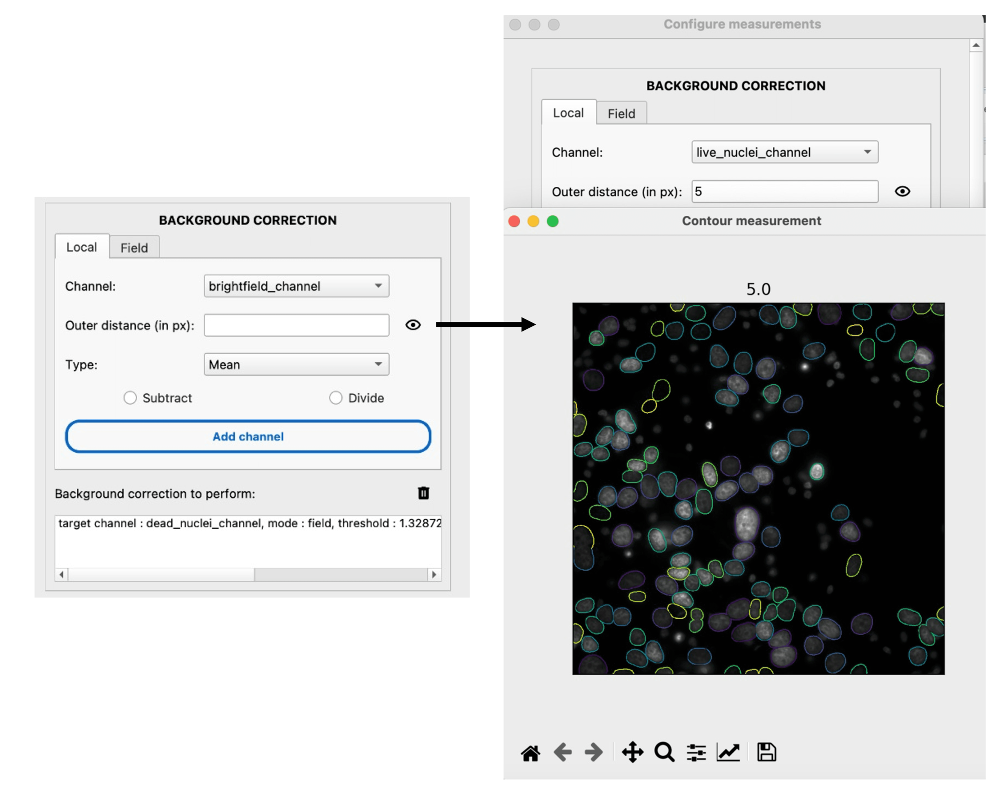
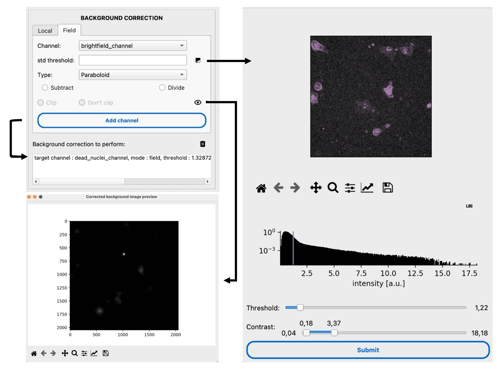
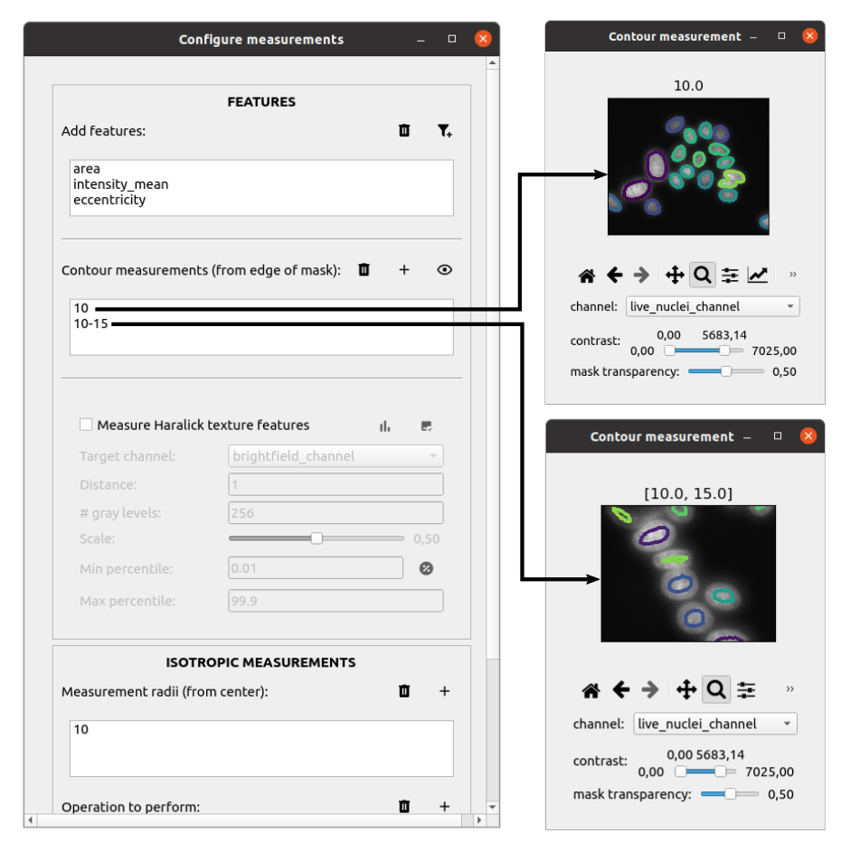
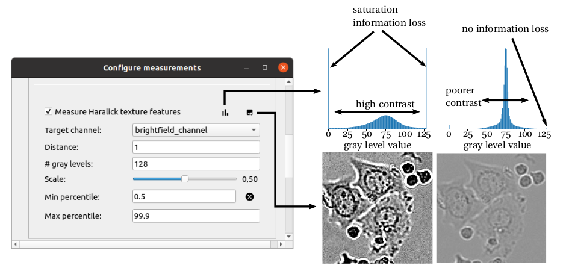
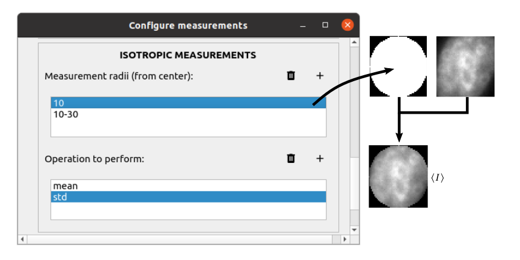
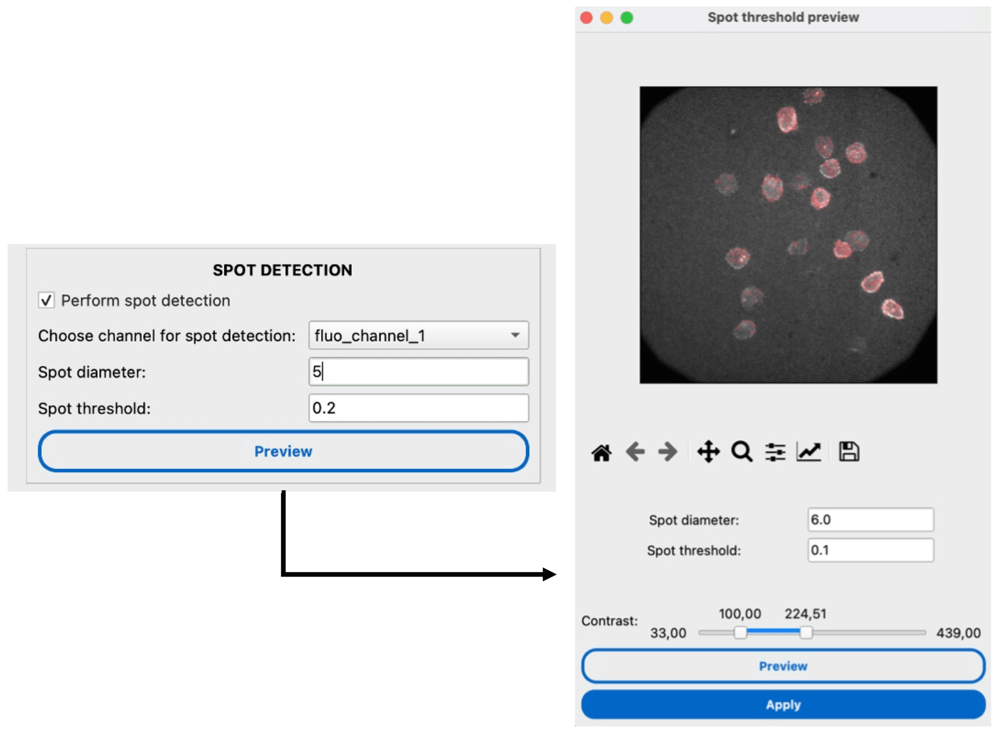
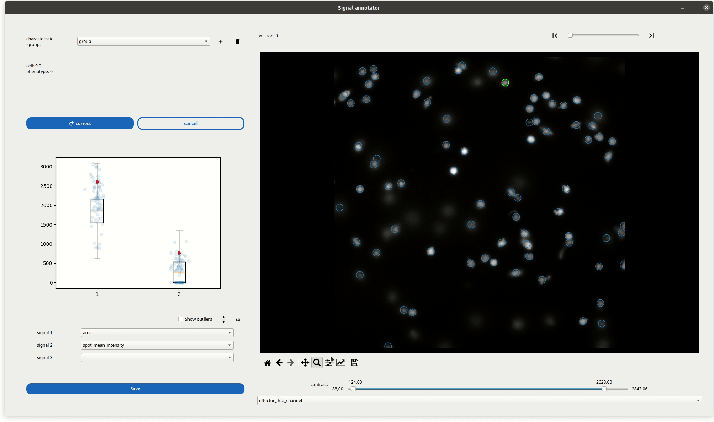

Measure
=======

.. _measure:

Prerequisite
------------

You must segment the cells prior to measurements. The cells can be tracked or not.

I/O
---

The measurement module takes both the segmentation masks and microscopy images as input. If the cells were tracked prior to measurement, the trajectory table is appended with new columns corresponding to the measurements. Otherwise, a look-alike table is output by the module, without a ``TRACK_ID`` column (replaced with an ``ID`` column).

Options
-------

Background correction
~~~~~~~~~~~~~~~~~~~~~

The background correction module allows you to correct the background intensity in a specific channel, 1) locally (``Local ``) or 2) over the field of view (``Field ``). In the ``Local `` mode, each cell is corrected one by one by the surrounding background intensity. You can estimate the background intensity level over any controlled distance. We provide a visualization tool for these background ROIs. You can measure 1) the mean or 2) the median intensity within the background ROI around each cell, which you can either 1) divide or 2) subtract from the intensity of the cell. 

    **GUI to pilot local background correction, with a highlight on the region accounted for during the correction.** The channel on which the correction is to be performed can be selected from the dropdown menu containing all the channels of the experiment. The user can define and visualize contour bands, defining the background ROIs that will be used in the correction. Here, the bands are shown for an image of MCF7 cell stained nuclei. The user can then choose whether to perform background subtraction or division based on mean or median background value.

In most instances, the background can be fitted by a 2D function such as a plane or paraboloid, provided we can isolate the background from the cells on the image. You can set a threshold on the standard-deviation-transformed image to roughly exclude the cells from the fit. A visualizer accompanies you in the process. You can choose to 1) divide or 2) subtract the extracted background from the whole image. When subtracting, you can decide to clip negative values. Eventually, you can preview the corrected image and view the change in diagonal intensity profiles.

    **GUI to pilot field background correction, with a highlight on the threshold interface and corrected image preview** The channel on which the correction is to be performed can be selected from the dropdown menu containing all the channels of the experiment. The user can define the threshold and visualize it with the help of threshold preview interface. The user must choose the type of background distortion present in the image and choose whether to perform background subtraction and division, with or without clipping.

All the background correction parameters that are set to be performed are visible in the list block just below.

Mask-based measurements
~~~~~~~~~~~~~~~~~~~~~~~

The segmentation mask is an obvious starting point to perform single-cell measurements that are tonal, textural and morphological. The mask provides a ROI over which a series of measurements can be performed at each time point. The mask can also be used to define sub sections. 

One practical subsection that can be extracted using the Euclidean distance transform of the mask is a contour or slice. This decomposition of the mask can be used to assess the peripherality of a fluorescence signal. 

    
    **GUI to pilot single cell measurements, with a highlight on contour intensity measurements.** Mask-based measurements are picked from the list of region properties defined in ``regionprops``. The user can define and visualize contour bands, over which to compute tonal features. Here, the bands are shown for an image of MCF7 cell stained nuclei. The user can enable the computation of Haralick texture features and pilot isotropic measurements.

For morphological and tonal measurements, we rely on the scikit-image library and more specifically ``regionprops`` that provides a fast computation of features from masks.

In addition, we propose some extra measurements relevant to the study intensity distributions within single cells, 1) a peripherality of intensity estimate and 2) a center of mass displacement estimate, within the cell mask. We compute the peripherality estimate for each single cell by correlating the Euclidean distance of the pixels to the cell mask edge with their intensity. We extract the slope and intercept of a linear fit to define the estimate. The center of mass displacement is defined as the difference between the geometric centroid of the cell mask and the intensity-weighed centroid. The output is the Euclidean distance between the two centroids and the orientation in degrees. We also make it possible to focus the detection of the center of mass displacement at the edge only, such that the estimate is no longer sensitive to the intensities inside the cell mask.

For texture measurements, we provide several options to measure the texture averaged over cell masks, with refined parameters. You can control carefully the image normalization and play with the distance, scale and # gray levels to make the computation time acceptable while not destroying texture information.

    
    **GUI to pilot texture measurements.** A section of the measurement configuration window is dedicated to the measurement of the Haralick texture features. As it is computationally expansive, measuring the texture is optional. The user selects the channel of interest within all of the channels available in the loaded experiment. A slider sets the scale parameter to scale down the image before textural computations. The # gray levels field sets the :math:`n_{GL}` parameter. A switch button allows to turn the min/max percentile fields into min/max value fields. A distance field sets the distance over which to compute intensity co-occurrences. On the top right corner, two visualization tools allow to control respectively the histogram of the digitized image and the digitized image itself.

Position-based measurements
~~~~~~~~~~~~~~~~~~~~~~~~~~~

The post-processing operations performed on the trajectories can introduce spatial locations for which there is no associated mask. Indeed, interpolating missing points in trajectories leaves open the question of how and what to measure in these new locations. An even more extreme case is track sustaining, which creates a completely new set of locations where the cell may not even exist. 

In absence of orientational information, the best course of action was to go for an isotropic (circle or ring) measurement of intensities, centered on the positions, irrespective of whether they were interpolated or not. Therefore, for a complete track we could always expect a complete intensity measurement. Obviously, tuning the radius of this circle (or radii for the ring) is an important choice.

    
    **GUI to pilot isotropic measurements.** This section of the measurement configuration window is dedicated to setting up isotropic tonal measurements. The user can define and manage as many circle and rings as desired. Then the operations to be performed on the intensities within the circle or ring are defined right below. By default, all measurements are applied to all available channels in the experiment.

The isotropic measurements are interfaced in almost the same way as the contour measurements, with the exception that the operation to perform over the circle (or ring) ROI has to be defined below (among mean, standard deviation and others). Upon submission, a subprocess is launched to take each multichannel frame one by one and perform, first, the mask measurements, and second, the isotropic measurements with the kernel defined here. In the example above, if its for three-channel microscopy data then 3 × 2 × 2 = 12 signals will be generated for each tracked single cell.

Spot detection
~~~~~~~~~~~~~~~~~~~~~~~~~~~

We provide a module for spot detection to count the number of blob-like objects of similar size within a cell mask. You must estimate the average diameter of the spots (in pixels) and increase the intensity threshold to remove false positive detections. A visualizer helps determine the detection parameters. The module computes the total number of detected spots and their mean intensity per cell.

    **GUI to pilot spot detection** The last section of the measurement configuration window is dedicated to spot detection. The user can choose the channel on which the spot detection is to be performed from dropdown menu. Then an approximate spot diameter and relative spot intensity threshold should be defined. The user has an option to preview the spot detection with the specified parameters and adjust them if needed in the spot preview interface.

Static measurements annotation
~~~~~~~~~~~~~~~~~~~~~~~~~~~~~~

We provide a viewer for the measurements of single cells. You can open an image stack and navigate it frame-by-frame, with an option to switch the channel. You can click on individual cells, represented by circles on the image, and categorize them manually based on their characteristics. You can define a group in which you assign a phenotype for each cell. A value (and color) encodes for the cell phenotype. You can display the measurements of a given cell on the left-side graph by simply clicking on it on the image. The boxplots show the spread of values for all cells in the stack. The strip plot shows the measurements for the cells within the current frame. The red dot is the cell of interest. You can represent up to three measurements at a time, with options to normalize and log-rescale the measurements if they span orders of magnitude. Additionally, you can display the outliers for the boxplot, hidden by default.

The tool is compatible with static and dynamic data. It is particularly relevant when reliable tracking of the cells is impossible, due to a poor time resolution.

    Application on an ADCC system of MCF-7 breast cancer cells co-cultured with human primary NK cells.
