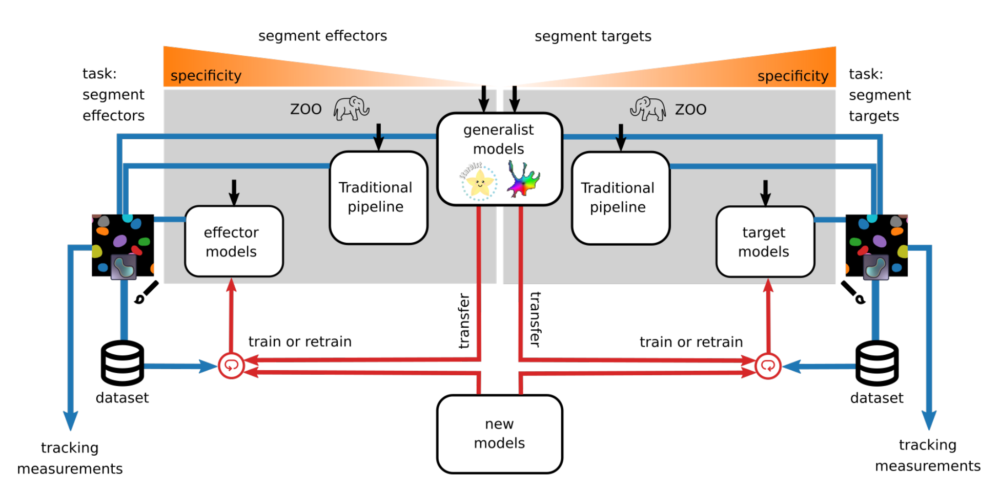
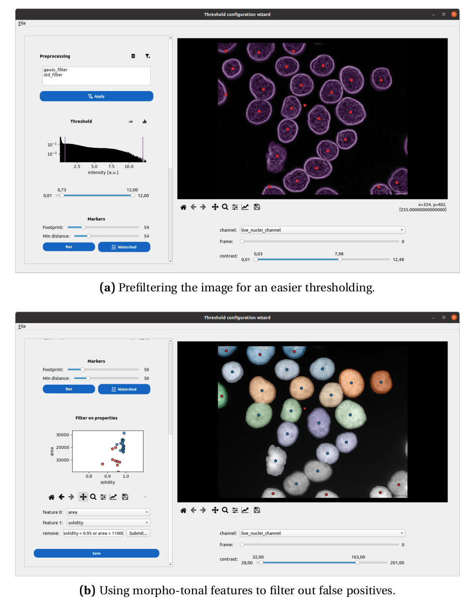
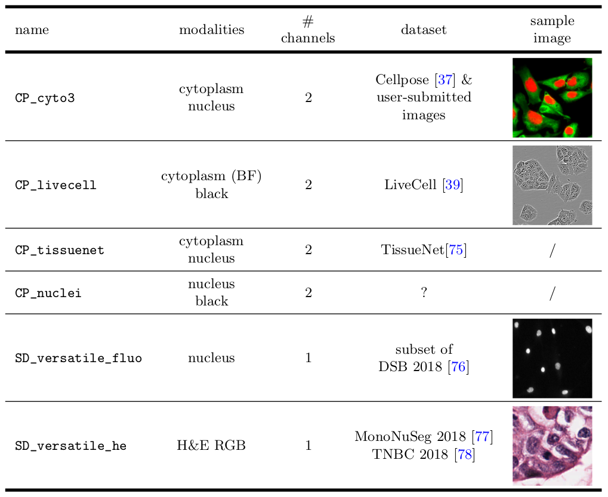
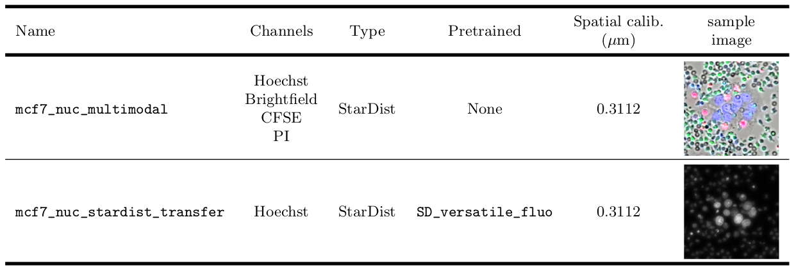
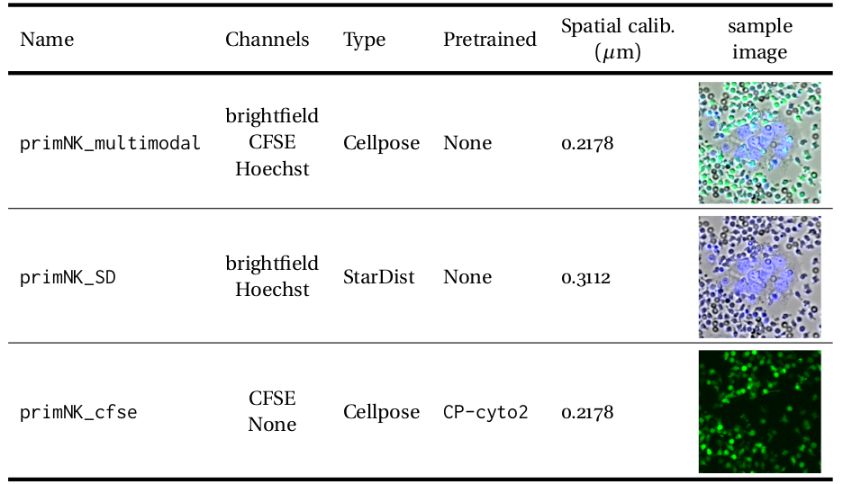
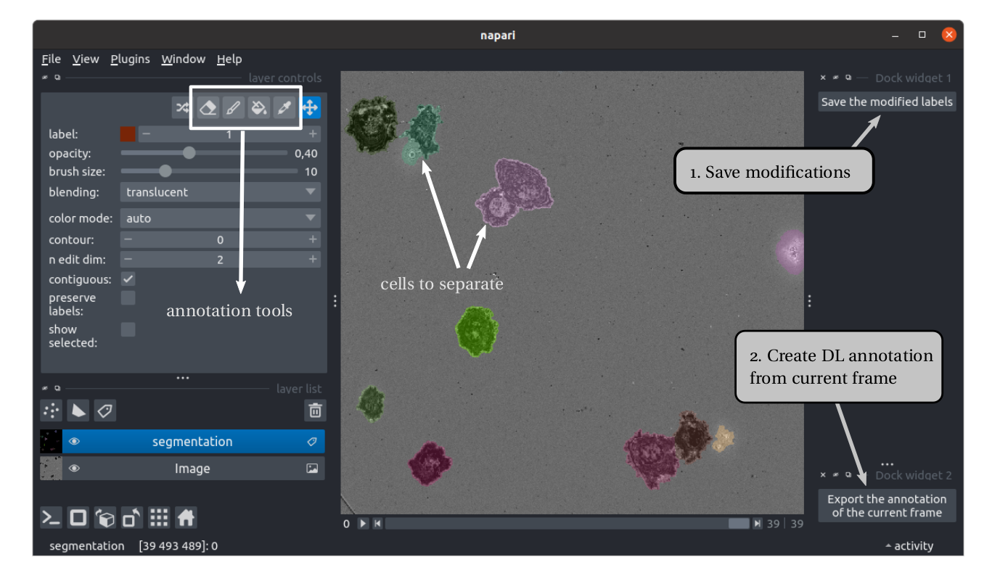

Segment
=======

.. _segment:

I/O
---

The input to the segmentation module is a stack of microscopy images. The output is a stack of instance segmentation masks, delineating each cell of the images. It is saved frame by frame in a ``labels_*population*`` subfolder of each position folder.

Overview
--------

The process of instance segmentation takes an image (multichannel or not) as its input and yields a label image (2D), where each segmented object is attributed a single label. 

In Celldetective, you may want to specifically segment up to two cell populations of interest on the images (typically target and effector cells but it could be anything). Segmentation can be carried out using traditional segmentation pipelines (based on filters and thresholds) or using Deep-learning models trained for such task. Celldetective proposes both options and allows a cross-talk between the two. As illustrated below, the output of a traditional segmentation can be corrected and used as an input to a DL model directly in Celldetective. That is only one of many paths to perform segmentation in Celldetective.

    
    **Overview of segmentation options in Celldetective.** Celldetective provides several entry points (black arrows) to perform segmentation, with the intent of segmenting specifically a cell population (left : effectors, right : targets). The masks output from each segmentation technique can be visualized and manually corrected in napari. Exporting these corrections into a paired image and masks dataset can be used either to fit a generalist model (transfer learning) or train one from scratch. Once the segmentation is satisfactory enough, the user can decide to proceed with the tracking and measurement modules.

Traditional segmentation
------------------------

In many applications, cell or nucleus segmentation can be achieved through the use of filters and thresholds, without having to resort to a Deep Learning model. Adapting such a model to a new system can be time-consuming and computationally expensive, as it usually requires numerous annotations. To ensure a user-friendly experience with Celldetective, we developed a robust framework for traditional segmentation as a potent alternative to calling a Deep Learning model. 

We call this UI the ``Threshold Configuration Wizard``. In broad terms, this interface allows the user to define a segmentation pipeline which can be broken into the following steps: 

#. applying filters to activate the relevant regions in the images
#. setting a threshold on the processed image to generate a binary segmentation
#. using the watershed method to transform the latter into an instance segmentation 
#. eliminating objects based on morpho-tonal features and spatial location.

    
    **The threshold configuration wizard in action.** Application of the TCW to an image of HaCaT cell nuclei stained with DAPI from the dataset S-BSST265 [#]_  is loaded into the threshold configuration wizard of Celldetective. a) the raw image undergoes a series of preprocessing filters, namely a gauss filter with a kernel (2×2) and a standard-deviation filter with a kernel (2×2). The upper and lower thresholds on the transformed intensities are set and the image is binarized. Peak detection parameters are optimized to the size of the nuclei. b) Post-watershed application, the original image and its instance segmentation are shown on the right side panel. Single object measurements are automatically performed to facilitate the identification and removal of false-positive detections. In this application, a filter based both on area and solidity effectively eliminates nuclei truncated at the edges and smaller objects.

This output is visualized and annotated in the napari viewer [#]_ , that we completed with simple plugins to manage corrections and export annotations. 

How to open the Threshold Configuration Wizard
~~~~~~~~~~~~~~~~~~~~~~~~~~~~~~~~~~~~~~~~~~~~~~

To launch the TCW, set a specific position within an experiment. Then for the population of interest, click on the ``UPLOAD`` button in the segmentation section. Toggle the threshold option. Click on the ``Threshold Config Wizard`` button to open it.

Upon startup, the TCW loads the initial frame of the movie associated to the selected position, operating in virtual-stack mode where only one frame is in memory at a time. An automatic threshold binarization of the image is overlaid into the image, in semi-transparent magenta. You can choose a different channel, navigate to another time-point and re-adjust the image contrast. Once you are satisfied with the image selection, avoid modifying these settings until the configuration process is complete.

Upon clicking on the ``Save`` button, all choices are written down in a ``json`` configuration file, saved automatically in a ``configs/`` sub-folder of the experiment folder, and the TCW closes automatically. The path to this configuration file is automatically loaded in the ``Upload model`` window, and it is up to you to click on ``Upload`` to effectively load it in Celldetective. 

Apply a threshold configuration to your data
~~~~~~~~~~~~~~~~~~~~~~~~~~~~~~~~~~~~~~~~~~~~

If you want to apply a previously defined threshold configuration pipeline to segment your cells, click on the ``UPLOAD`` button, toggle ``Threshold``, locate your config file. Click on ``Upload``.

In the segmentation model zoo, select the ``Threshold`` option. Submit to segment your data.

.. note::
    
    You have to reload the threshold config file, everytime you reopen an experiment

Deep learning segmentation
--------------------------

Models
~~~~~~

Simultaneously, we propose Deep-learning segmentation models trained with the StarDist [#]_ or Cellpose [#]_ [#]_ algorithm. They are split in two families: 

#. The generalist models: models published in the literature that have been trained on thousands of images with one or two channels, on general tasks such as segmenting all nuclei visible on the images. In some cases, more than one modality was passed in the channel slots during training to force the model to generalize and be less sensitive to the modality. 
#. Models specific to a cell population: models that we trained from scratch on brand new multimodal data to achieve more specific tasks such as detecting the nuclei of a population in the presence of another. In this configuration, accurate segmentation often requires to look at multiple channels at once, *i.e.* performing a multimodal interpretation.

    
    **Generalist models.** This table lists the different generalist models (Cellpose or StarDist) which can be called natively in Celldetective. The images have been sampled from their respective datasets, cropped to ( 200 × 200 ) px and rescaled homogeneously to fit in the table.

    
    **Target models.** MCF-7 nuclei segmentation models that we developed for our application. The models have been trained on the ``db_mcf7_nuclei_w_primary_NK`` dataset available in Zenodo.

    
    **Effector models.** Primary NK segmentation models that we developed for our application. The models have been trained on the ``db_primary_NK_w_mcf7`` dataset available in Zenodo.

Apply a model to your data
~~~~~~~~~~~~~~~~~~~~~~~~~~

The models are available in the segmentation model zoo. To call one, tick the ``SEGMENT`` option, simply select the model in the list, and press submit. If the model is a generalist one, you must tell Celldetective which channels you want to pass to the model. Image rescaling and normalization is handled automatically using the information you provided in the experiment configuration.

Mask visualization and annotations
----------------------------------

Once you have segmented a position, select it in the top part of the control panel. The eye icon in the segmentation section becomes active. Click on it to trigger napari. You will view the segmented images as well as the original images. With napari, you can correct segmentation mistakes. 

We provide two simple plugins to:

#. save the mask modifications inplace
#. export a training sample, to train a Deep learning model on your data directly through Celldetective, with the ``TRAIN`` button

    
    **napari**. napari provides the basic requirements of image manipulation software, namely a brush, rubber, bucket and pipette, to work on the segmentation layer. In this RICM image of spreading NK cells, two couples of cells have been mistakenly segmented as one object and must be separated. On the right panel, two plugins specific to Celldetective allow 1) the export of the modified masks directly in the position folder, and 2) to create automatically an annotation consisting of the current multichannel frame, the modified mask and a configuration file specifying the modality content of the image and its spatial calibration.

References
----------

.. [#] Florian KROMP, Eva BOZSAKY, Fikret RIFATBEGOVIC, Lukas FISCHER, Magdalena AMBROS, Maria BERNEDER, Tamara WEISS, Daria LAZIC, Wolfgang DÖRR, Allan HANBURY, Klaus BEISKE et al. « An Annotated Fluorescence Image Dataset for Training Nuclear Segmentation Methods ». In : Scientific Data 7.1 (1 11 août 2020), p. 262. ISSN : 2052-4463. DOI : 10.1038/s41597-020-00608-w . URL : https://www.nature.com/articles/s41597-020-00608-w.

.. [#] Ahlers, J. et al. napari: a multi-dimensional image viewer for Python. Zenodo https://doi.org/10.5281/zenodo.8115575 (2023).

.. [#] Schmidt, U., Weigert, M., Broaddus, C. & Myers, G. Cell Detection with Star-Convex Polygons. in Medical Image Computing and Computer Assisted Intervention – MICCAI 2018 (eds. Frangi, A. F., Schnabel, J. A., Davatzikos, C., Alberola-López, C. & Fichtinger, G.) 265–273 (Springer International Publishing, Cham, 2018). doi:10.1007/978-3-030-00934-2_30.

.. [#] Stringer, C., Wang, T., Michaelos, M. & Pachitariu, M. Cellpose: a generalist algorithm for cellular segmentation. Nat Methods 18, 100–106 (2021).

.. [#] Pachitariu, M. & Stringer, C. Cellpose 2.0: how to train your own model. Nat Methods 19, 1634–1641 (2022).

