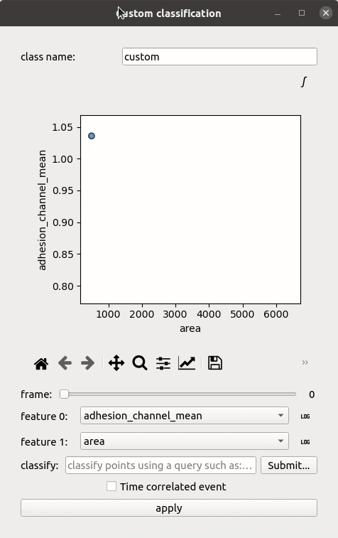

Signals and events
==================

.. _signals_and_events:

Prerequisites
-------------

Perform segmentation, tracking and measurements for either target or effector cells. Select a single position.

Principle
---------

The single cell measurements described in the previous section are performed instantaneously, one image at a time, implying that there is no integration of time or description of dynamic phenomena yet. The time-dependence emerges naturally when these measurements are represented as single cell signals, *i.e.* 1D timeseries, over which we can hope to detect transitions characterizing the dynamic biological phenomena of interest. 

Our formulation for this problem is that cells can be classified into three categories with respect to an event : 

#. Cells that exhibit an event of interest during the observation window: class “event”
#. Cells that do not exhibit it: class “no event”)
#. Cells that either exhibited the event before the observation started or else: class “else”

Cells belonging to the first class, can be associated with a time :math:`t_\textrm{event}`. 

Deep-learning signal analysis
-----------------------------

We provide several Deep-learning models that take select single-cell signals as their input and determine the event class and time of event (if any) for all cells. Exactly as for the segmentation models, we provide a zoo of such models that can be applied to positions or wells, in the signal analysis section. The result can be corrected and monitored in the signal annotator UI. 

Threshold-based event characterization
--------------------------------------

We also provide a binary classification module, allowing you to classify cells to any number of classes or groups of interest in a "static" way, one frame at a time, based on feature values. This classification process yields a binary signal, which can be interpreted:

#. a perfectly null signal is associated to the absence of event
#. a completely positive signal is associated to an event that already happened
#. a sigmoid-like switch is a transition from an absence of event to an event. The time of event is extracted by fitting a sigmoid on the binary classification signal. A :math:`R^2` score is computed. If the score is higher than 0.7, the time is kept, otherwise the cell is classified as "else", to be corrected.

Click on the ``Classify data`` button of the measurements section. Define a name for the class/event/group. Project as many features of interest and write down the classification conditions for the event of interest. Apply to write in the tables the new class/group. If the ``TRACK_ID`` column is in the table (tracked data) and the ``Time correlated event`` option is checked, the sigmoid-fitting process will be triggered to extract the event times and create a class. When ``Time correlated event`` option is not checked, instead of a class/event, a characteristic group will be created and the phenotypes will be assigned accordingly.

    The window to perform a feature-based classification on either static detections or trajectories.

Single-cell signal visualization
--------------------------------

Single annotator configuration
~~~~~~~~~~~~~~~~~~~~~~~~~~~~~~

Celldetective ships a powerful viewer for single-cell signals. If a single position is set and tracking has been performed for a cell population, the eye icon in the signal analysis section becomes active. 

Click on the configuration button next to the eye to configure the image displayed and the animation parameters in the signal annotator. 

The available options are:

* a grayscale or a RGB composite representation of the microscopy images, with per-channel normalization to define in case of RGB composite
* a fraction to control the rescaling applied to the images as they are loaded in memory. The smaller the fraction, the easier it will be to run the animation on a less powerful computer. 
* a time interval to set the gap in milliseconds between each frame in the animation. 

Upon saving, a small configuration file is saved in the experiment folder in such a way that the settings can be reloaded in later sessions. Click on the eye to proceed.

Single annotator UI
~~~~~~~~~~~~~~~~~~~

.. figure:: _static/signal-annotator.gif
    :width: 800px
    :align: center
    :alt: signal_annotator

    Application on an ADCC system of MCF-7 breast cancer cells co-cultured with human primary NK cells where the Hoechst nuclear stain is blue, PI nuclear stain in red and CFSE marks the NK cells in green. Upon killing by the NK cells, the nuclei of MCF-7 cells turn red. 

In this application, blue cell nuclei turn red when a target cell is killed by a cell from the green population. You can zoom in the animation, move around, and click on any single cell of interest. The center of mass of cells is coded by a dynamic double scatter plot. The cross symbol encodes the cell class. The circle around the cross shows the current cell status (whether the event happened before the current frame or not). Upon clicking, the signals are updated in the left side panel, to show the measurements of the selected cell. You can view simultaneously up to three signals. Since quantities can be wildly different, normalization and log-rescaling buttons can be triggered to rescale the signals.

In the top part of the left side panel, you select the event of interest. Changing the event updates the colors attributed to each cell marker in the animation. You can decide to create a brand new event and annotate cells (almost) from scratch: you set an initial class for all cells to be modified. The class of a single-cell with respect to an event can be modified. Similarly, the time estimated in the case of an event can be changed to a different value. Don't forget to click on "Save" to save all modifications.

.. note::

   Cells marked for deletion (key Del), are temporarily colored in black. Upon saving, they are removed completely and cannot be recovered again.

If all cells have been annotated for an event of interest, you can decide to export a training set for signal analysis with a Deep Learning model, by clicking on the export button on the right side of the "Save" button. 

Keyboard shortcuts 
~~~~~~~~~~~~~~~~~~

Here are some keyboard shortcuts to facilitate single-cell annotations with the signal annotator UI.

+---------------------+-----------------------------------------------+
| Keyboard shortcuts  | Description                                   |
+=====================+===============================================+
| l                   | show the last frame                           |
+---------------------+-----------------------------------------------+            
| f                   | show the first frame                          |
+---------------------+-----------------------------------------------+
| Esc                 | cancel cell selection                         |
+---------------------+-----------------------------------------------+
| Del                 | mark cell for deletion                        |
+---------------------+-----------------------------------------------+
| n                   | set cell class to no event                    |
+---------------------+-----------------------------------------------+
