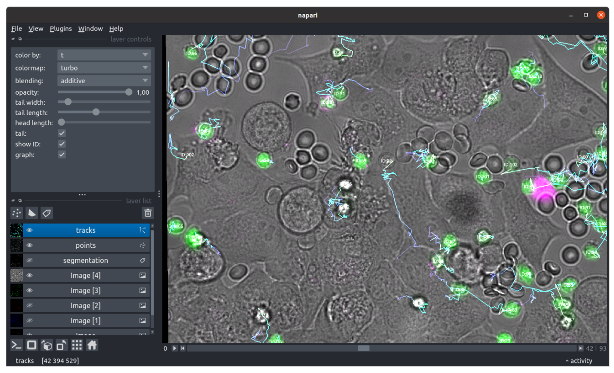

Track
=====

.. _track:

Prerequisite
------------

You must segment the cells prior to tracking.

I/O
---

This modules takes the instance segmentation label images, the original microscopy images (if you asked for feature measurements) and outputs a trajectory table where each line represents a cell at a given timepoint.

Adapt the tracker to your cells
-------------------------------

After segmentation, tracking the cells is a necessary step to attribute a unique identity, to each cell in a movie. Since cells exhibit complex motion that often goes well beyond the scope of Brownian motion, we decided to interface the state-of-the art tracking method bTrack [#]_ , exploiting both the motion history and the appearance of the cells to make the best tracking hypotheses. This tracker requires a configuration file to set all of the motion and tracklet connection hypotheses.

The settings button in the tracking module allows to :

#. fine-tune the bTrack configuration
#. pilot feature measurements to help the tracker
#. define a post-processing pipeline on the trajectories

.. figure:: _static/tracking-options.png
    :width: 400px
    :align: center
    :alt: tracking_options
    
    **GUI to configure the tracking parameters.** A bTrack configuration can be modified in place, or other configurations can be loaded. Features can be passed to the tracker. Post processing modules clean up the raw trajectories for subsequent analysis.

.. note::
    
    You can import a bTrack configuration produced with the napari-bTrack plugin

Once the tracking configuration is properly set, click on ``Save``, tick the ``TRACK`` option in the control panel and execute. A subprocess loads the multichannel images and the masks one frame at a time, to extract all cell locations. If you enabled features, they are measured along the way. Then the bTrack configuration is loaded, and the cell locations (with features) are passed to the tracker. The potential features are all normalized independently, using a standard scaler. The tracking mode switches from ``motion`` to ``motion + visual`` depending on the presence of features. The tracking is performed and a ``csv`` table containing the tracks is generated in the ``output/tables`` subfolder of each position.

Visualization
-------------

Once the tracking step is complete, you can view the raw bTrack tracks (before post-processing) by clicking on the eye button in the tracking module (select a single position first). 

    
    **View tracks in napari**

References
----------

.. [#] Ulicna, K., Vallardi, G., Charras, G. & Lowe, A. R. Automated Deep Lineage Tree Analysis Using a Bayesian Single Cell Tracking Approach. Frontiers in Computer Science 3, (2021).
