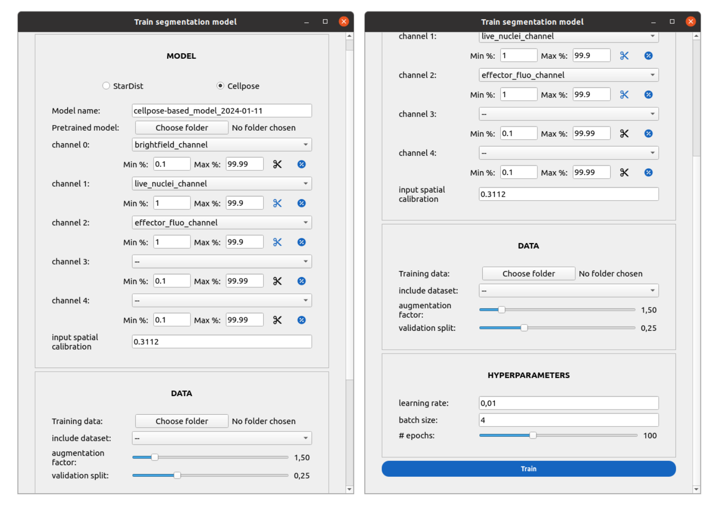

Train a cell segmentation model
===============================

Prepare your training data
--------------------------

Once you segment a movie, you can view and correct the outcome in napari by clicking on the eye button of the segmentation module. We provide you with an ``Export annotations`` button to automatically prepare the image you are looking at as a training sample for a segmentation model.

.. note::
    
    Make sure to annotate correctly all cells of the image before exporting the annotation, otherwise the model will be taught to learn mistakes!

The annotations are automatically stored in a folder created at the root of your experiment folder named ``annotations_*population*``. 

Train a model in the GUI
------------------------

Click on the ``TRAIN`` button of the segmentation module. Select between a StarDist or Cellpose model. You can load a previously downloaded model to perform a transfer on your new data. Set the channels, the normalization settings and the standardized spatial calibration for the input images. 

.. note::
    
    Cellpose requires at least two channels, but the second can be passed as ``None`` (black frame)

.. note::

    The annotations you made with napari stored automatically the spatial calibration of your images, read from the experiment configuration

Point towards your ``annotations_*population*`` folder to select the training data. Optionally, you can add one of two datasets we provide to segment:

#. MCF-7 cell nuclei in the presence of NK cells
#. NK cells in the presence of MCF-7 cells

The ``augmentation_factor`` parameter indicates how the volume of training data is to be increased with augmentation, the validation split controls the amount of validation data (not augmented).

Tune your hyperparameters: learning rate, batch size and the number of epochs. Training time will vary considerably depending on your hardware (NVIDIA GPU or not). Click on ``TRAIN``.

.. _train-seg-models:

    
    **Training segmentation models.** a) From top to bottom : the user chooses between a StarDist
    and Cellpose model, and names the model. A pretrained model (generalist, specific) can
    be loaded to perform transfer learning. The channels and their normalization settings are
    defined. The desired spatial calibration for the input data is defined. In the ``DATA`` section,
    the user can point towards a folder containing annotations generated with napari (e.g. the
    ``annotations_*population*/`` folder). The user can include a dataset, a folder of annotations
    integrated directly in Celldetective. The augmentation factor slider controls the volume of
    augmented data in the train set. The validation split slider sets the volume of the validation
    set. In the ``HYPERPARAMETERS`` section, the user must set the number of training epochs, the
    learning rate and the batch size.

Upon completion, the new model will be stored in the segmentation models zoo, ready to be applied to your data.

