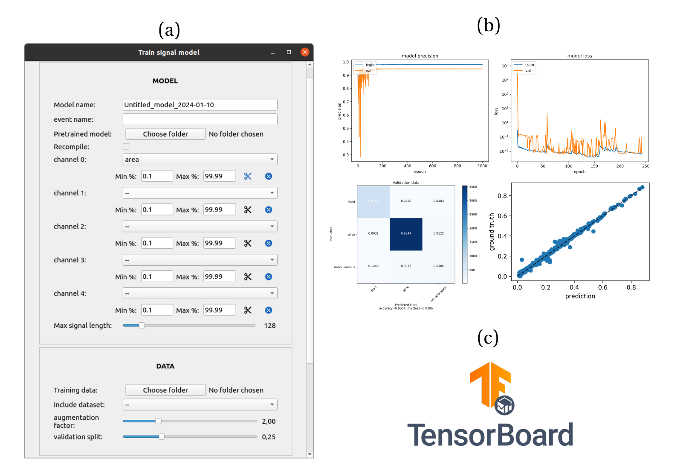

Train single-cell signal analysis models
========================================

.. _train-signal-models:

Prepare your training data
--------------------------

You can use the signal annotator UI to control and correct single-cell classification and even time estimate with respect to an event. If you are satisfied with the correction, you can export a training set for the event under study, which will be a ``npy`` file containing all single-cell signals of the field of view, a ``class`` attribute and a ``t0`` attribute giving :math:`t_\textrm{event}` . If you store several sets in a folder, you can point towards this folder to train on all sets.

.. note::
    
    Be careful when you handle several events at the same time. The export button will only export the classes and times for the event being monitored when you click on the button

Train a model in the GUI
------------------------

Click on the ``TRAIN`` button in the signal analysis module. Set a name for the model and describe in one word the event (*e.g.* lysis, division, death...). You can start from a previously trained model or from scratch. Set the channels (*i.e.* single-cell signals of interest), define the normalization procedure. You must set the max signal length: the standardized length of the signals when they enter the model (take a value higher than your highest movie duration, in frames). 

For the training data, locate the folder where you stored the ``npy`` annotations for the event of interest. You can include datasets among the ones we developed in Zenodo to detect lysis events characterised by a sigmoidal-like increase of the dead nuclei intensity signal ``db-si-NucPI``, or nucleus shrinking characterized by a decreasing nuclear area signal ``db-si-NucCondensation``. 

.. _train-seg-models:

    
    **Training signal models.** a) From top to bottom : the user names the model and the event
    (one word). A pretrained model can be loaded to perform transfer learning or gather a
    specific architecture. The pretrained model can be recompiled. All input channels and their
    normalization are defined. The length :math:`T` of the input tensor is set with a slider (max signal
    length). The folder containing the annotations is set, with the option to load extra data
    stored as in Celldetective as datasets. The augmentation factor slider controls how many
    signals are to be augmented in the train set. The validation split slider sets the volume of
    the validation set. Extra options (not shown) include setting the number of training epochs,
    the learning rate and the batch size. b) visualizations are produced at the end of the training
    process to control the quality of the best models. c) the training process can be monitored
    in detail in TensorBoard.

